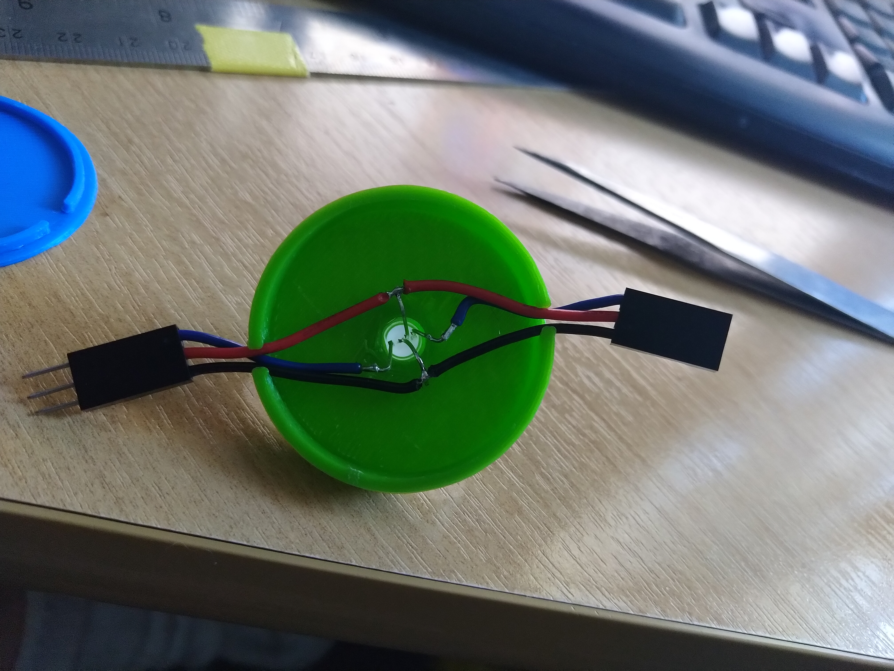

# LED Christmas Trees

Using 3D printer, and the tree designs from https://www.thingiverse.com/thing:193814
The LED "Tea Light" bases I printed from the included designs in the 3DPrintFiles directory.

Each tree has a NeoPixel 5MM LED, Setup to be easy to daisy chained together. The program is based on the esamples from "NeoPatterns" (Source included as it needed a little modification to comple) on an ESP8266 (you could use something else) 

### LED Holder Assembled

### LED Holder Underside Wiring

### Video

## Wiring up.
ESP8266, Data pin D4, its next to ground and 3v3 so handy to hookup with 3 wires in the sequence of Signal, 3V3, Ground.

Button - on pin D5 to Ground, clicking will select the current sequence and repeated clicks cycle through them. A press > 1 second will go back to random mode.

## Compile
I have used Platform.io for this project (http://www.platformio.org)

